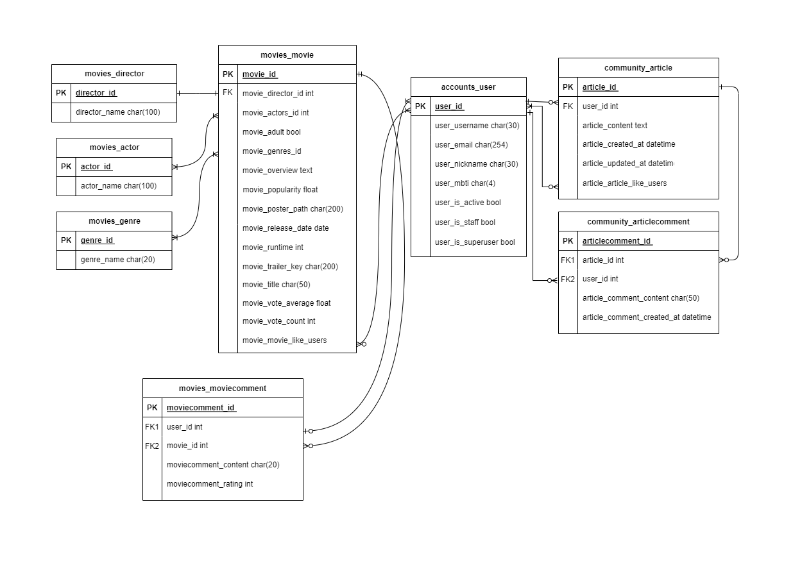
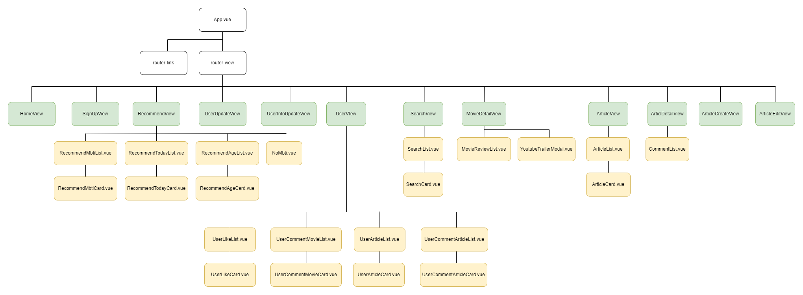

# Django와 Vue.js를 활용한 영화 추천 서비스 설계

### :calendar: 일시 : 2023.11.16.(목) ~ 2023.11.23.(목)  

### :star: 팀원
| 이름 | 역할 |
| ---- | ---- |
| 강민지 | - 프론트엔드 중심<br>- 백엔드 데이터 받아서 프론트엔드 기능 구현, CSS |
| 김민욱 | - 백엔드 중심<br>- DB 모델링, API 서버 데이터 받아오기 |

### :pushpin: 목표
- TMDB API와 Youtube API를 활용한 영화 추천 서비스 구성
- 사용자의 MBTI, 나이 등 사용자 입력 데이터 기반 및 현재 날짜 기준 추천 알고리즘 설계

### :love_letter: 설치 안내
서비스 사용을 위해 아래의 방법으로 실행합니다.
레퍼지토리를 clone 받습니다.
#### [BACK-END]
1. final-pjt-back 폴더에 필요한 프로그램을 설치합니다.
```
pip install -r requirements.txt
```
2. 서버 실행 전 필요한 데이터를 받습니다.
```
python manage.py makemigrations
python manage.py migrate
python manage.py loaddata datas.json
```
3. 설치 완료 후, 백엔드 서버를 실행합니다.
```
python manage.py runserver
```
#### [FRONT-END]
1. final-pjt-front/mvti-service 폴더에서 package.json에 정의된 패키지 및 모듈을 설치합니다.
```
npm install
```
2. 설치 완료 후, 프론트엔드 서버를 실행합니다.
```
npm run dev
```

### :hammer: 기술 스택
#### FRONT-END
    - Vue 3
    - JavaScript
    - HTML, CSS
    - BootStrap

#### BACK-END
    - Python
    - Django
    - TMDB API
    - YOUTUBE API

### :thumbsup: 기능 소개
| 구분 | 기능 | 설명 | 담당 |
| --- | ----- | ---- | -- |
| 회원 | - 회원가입<br>- 로그인<br>- 로그아웃<br>- 회원정보수정<br>- 회원탈퇴 | - dj-rest-auth를 활용하여 커스텀 구현 | 강민지, 김민욱 |
| 영화 정보 | 영화 포스터, 개봉일, 장르, 감독, 줄거리, 출연 배우, TMDB 평균 평점 등 조회| TMDB API를 활용하여 가져온 데이터 에서 키워드 별로 검색 기능 추가 | 김민욱 |
| 영화 평점 | 영화별 평점 및 한 줄 리뷰 등록 | 영화 평점을 조회하여 user별 영화 평점 평균 값 출력 | 강민지 |
| 영화 추천 | 영화 추천 알고리즘 | - MBTI별 성격이나 성향에 따른 키워드를 기반으로 영화를 추천<br>- 연령별 사람들이 대체적으로 좋아할 만한 장르를 기반으로 영화 추천<br>- 현재 날짜를 기준으로 계절을 나누고 계절별 키워드를 이용한 영화 추천 | 김민욱 |
| 커뮤니티 | 게시글 | - 게시글 조회 및 작성, 수정, 삭제<br>- 게시글 좋아요 | 강민지 |
| 커뮤니티 | 댓글 | 댓글 작성, 수정, 삭제 | 강민지 |
| 유저페이지 | 사용자 | - 좋아요한 영화 조회<br>- 평점 남긴 영화 조회<br>- 좋아요한 게시글 조회<br>- 댓글 남긴 게시글 조회 | 김민욱 |

### :closed_book: 데이터베이스 모델링 (ERD)


### :green_book: 컴포넌트 구조


### :boom: 이슈 관리
| 날짜 | 담당자 |   내용                        | 해결 방법(원인) |
|  --- | ----- |   ----                        | -------------- |
| 1117 | 강민지 |npm run dev 실행 오류| - npm log 오류 시 'npm install --cache'<br>- 폴더 위치 확인하기 |
| 1117 | 김민욱 |오류코드: RuntimeError: You calledthis URL via POST , but the URL doesn't end in a slash and you have APPEND_SLASH set. Django can't redirect to the slash URL while maintaining POST data. Change your form to point to 127.0.0.1:8000/api/v1/getdata/ (note the trailing slash), or set APPEND_SLASH=False in your Django settings.| url주소 마지막에 '/'를 붙여 주었다. 그리고 나서 또 다시 에러가 발생 |
| 1117 | 김민욱 |오류코드: AssertionError: Expected a Response, HttpResponse or HttpStreamingResponse to be returned from the view, but received a <class 'NoneType'>| view.py에서 Response를 안해줘서 발생한 오류 |
| 1117 | 김민욱 |오류코드: django.core.exceptions.ImproperlyConfigured: Requested setting REST_FRAMEWORK, but settings are not configured. You must either define the environment variable DJANGO_SETTINGS_MODULE or call settings.configure() before accessing settings.| 장고 환경에서 api키로 데이터 가져올 때 views.py 파일에서 python환경을 실행시키면 오류가 나온다. => print를 함수 안에 집어 넣고 서버를 실행시켜서 확인해야 한다. |
| 1120 | 김민욱 |loaddata가 잘 안됨| dumpdata를 할 때 model에 어떤 모델에 load될지 써줘야 하고, fields에 어떤 데이터가 load돼야 하는지 써줘야함 |
| 1121 | 강민지 |댓글 실시간 동기화 안됨 (새로고침 해야지만 반영)| 자식 요소에서 emit 추가해서 부모 요소에 이벤트 발생 알려주기 |
| 1121 | 김민욱 |영화추천 서비스를 위해 필요한 필드들이 부족했음| TMDB api에서 데이터를 받아올 때 여러 api 정보를 이용해서 영화 추천을 위한 필드들을 추가하여 받아옴 |
| 1122 | 강민지, 김민욱 |게시글, 영화 좋아요 버튼이 새로고침하면 좋아요가 된 상태인데도 불구하고 색깔이 바뀜|computed를 활용하고 movie_like_users, article_like_users를 활용하여 해결|
| 1122 | 김민욱 |dj-rest-auth를 활용하여 회원가입을 하는데 회원 조회할 때 기본적으로 주어진 필드만 나옴|dj-rest-auth는 유저를 조회할 때 다른 srializer를 사용해 줘야함 => 다른 serializer 만들고 => 장고 settings.py에 'USER_DETAILS_SERIALIZER': 'accounts.serializers.UserSerializer' 추가|
| 1123 | 강민지 |MovieDetailView로 이동시 “TypeError: Cannot read property ‘includes’ of undefined”|일시적인 서버 오류였음. 혹시 몰라서 렌더링 전에 undefined 의 속성에 접근하려 하는 것을 막기 위해 html 요소에 v-if 문 추가|
| 1123 | 김민욱 |영화 추천 첫화면이 새로고침을 해야만 나옴|기존에 for문과 if문을 활용한 추천 알고리즘이 아닌 computed와 fiter를 사용하여 해결|

### :thought_balloon: 느낀점
#### 강민지
프로젝트 하면서 가장 많이 한 말이 '이게 왜 안 되지'랑 '이게 왜 되지'였다. 아직 javascript와 웹 서버에 대한 지식이 부족하고 비동기 처리 로직에 대한 이해가 조금 덜 되서 가장 많이 발견한 오류가 undefined 이었다. 데이터가 다 받아지기 전에 onMounted 가 실행되면서 자잘한 오류들이 발생하는데 조금 더 공부가 필요할 거 같다.
그래도 좋았던 점은 처음부터 끝까지 좌충우돌이 많았지만 페어와 함께 해낸 것. 힘들었지만 재미있었다. 기술을 더 공부해서 다른 토이 프로젝트도 진행해보고 싶다.

#### 김민욱
처음으로 무에서 유를 창조하는 프로젝트를 진행하였다. 처음보는 오류들도 많이 만나보고 코드를 짜고나서 마음대로 실행이 되지 않아 쉽지 않았다. 코딩을 시작한지 이제 5개월 밖에 지나지 않았기 때문에 아직은 많이 부족하다는 생각을 했고, 앞으로 더 열심히 배우고 공부해야겠다.
